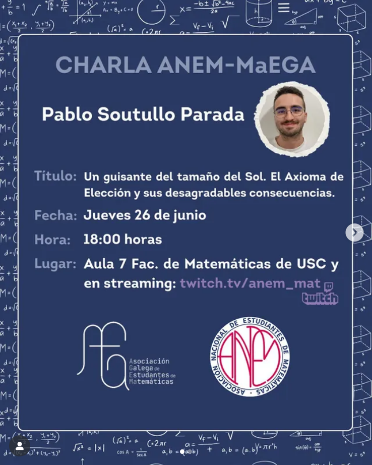

El jueves pasado tuvimos el placer de acoger una interesante charla impartida por Pablo Soutullo, estudiante del Grado en Matemáticas y miembro de MaEGA. El evento tuvo lugar en la Facultad de Matemáticas, en colaboración con la Asociación Nacional de Estudiantes de Matemáticas (ANEM).

<!--  -->



La conferencia se pudo seguir tanto presencialmente, en la Facultad, como en línea, a través de los canales de ANEM, ofreciendo así una experiencia accesible e interactiva. Los asistentes tuvieron la oportunidad de hacer preguntas y mantener un enriquecedor debate con el ponente. La grabación de la charla puede verse a través de Twitch:

<!--  -->
<iframe
  src="https://player.twitch.tv/?video=2496496449&parent=maega.gal"
  height="320"
  width="569"
  autoplay=false
  allowfullscreen>
</iframe>

La intervención giró en torno al Axioma de Elección y sus fascinantes implicaciones: desde el papel fundamental de los principios axiomáticos en la construcción de las matemáticas hasta su historia, necesidad y consecuencias contraintuitivas.

Esperamos seguir organizando más actividades matemáticas como esta y seguir fortaleciendo la colaboración con la ANEM próximamente.

