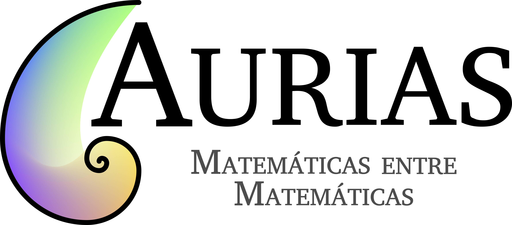

Aurias es un proyecto de MaEGA, la Asociación Galega de Estudantes de Matemáticas, creado este 2025 para promover la participación de chicas de entre trece e diecisiete años en múltiples actividades asociadas con las matemáticas, particularmente en las Olimpiadas Matemáticas y otras competiciones similares. La iniciativa surge por la preocupación de las estudiantes del Grado en Matemáticas ante la baja porcentaje de participación de mujeres en estas actividades. Por ejemplo, este año solo hubo un 28% de participación femenina en Olimpiada de Bachillerato, que se traduce en 101 chicos e 40 chicas.

Se sabe que a primero de carrera de matemáticas llegan unas sesenta mujeres cada curso, esto es casi un 50% del total de matriculados, por lo que resulta extraña esa diferenza. Aurias nace para reducir esta distancia.

Para esto proponemos un programa de amadrinamiento, junto con otras actividades asociadas.

Este programa busca conectar a las niñas interesadas con mujeres estudiantes del Grado en Matemáticas, del Doble Grado en Matemáticas e Ingeniería Informática y del Doble Grao de Física y Matemáticas, que se reunirían con estas una vez cada dos semanas de forma telemática y con un horario flexible con el fin de acercarles esta ciencia de forma más personal y con mayor facilidad. En estes encuentros poderán hablar sobre el mundo universitario, en particular, el asociado con las matemáticas y Santiago de Compostela, también tratarán y discutirán problemas tipo olimpiada matemática, pudiendo recibir formación específica y siempre desde un enfoque orientado a la aprendizaje personalizada y al desenvolvimiento de las capacidades y razonamientos matemáticos. El periodo lectivo sería desde marzo a enero, con descansos en mayo, julio, agosto, finales de diciembre y enero.

Contamos en este proyecto con la colaboración del Club Olímpico de la Facultad de Matemáticas, Sementeira, creado en 2017 y con amplia experiencia en la preparatoria y participación de concursos matemáticos nacionales e internacionales. De esta colaboración surge un manual de preparación, con el que podrán contar todas las participantes del proyecto.

Siendo los obxectivos de esta iniciativa acercarles matemáticas universitarias, muy distintas de las cursadas en la enseñanza secundaria, a las participantes y, como se dijo en el inicio, motivarlas a participar en actividades matemáticas, como pueden ser el concurso Explícoche Matemáticas 2.0 o las Olimpíadas matemáticas y un encuentro presencial opcional entre madrinas e ahijadas.

Si quieres incribirte, puedes hacerlo a través [de este enlace](https://docs.google.com/forms/d/e/1FAIpQLScOJ_JILc9EY3Qj1GpqrBKo6_lyrdaceS93p0RzgGk0lKLMwA/viewform) seguindo los siguintes pasos:
1. Cubre el formulario con un de tus tutores legales.
2. Recibirás un correo donde se te asigna plaza y madrina.
3. En menos de una semana, tu madrina se pondrá en contacto contigo para concretar un horario.
4. Disfrutarás de las sesiones.

Para poder garantizar la plaza, será necesario responder a los correos en, como máximo, una semana. Si tienes cualquier duda, puedes contactarnos a través del correo auriasmat@gmail.com.

