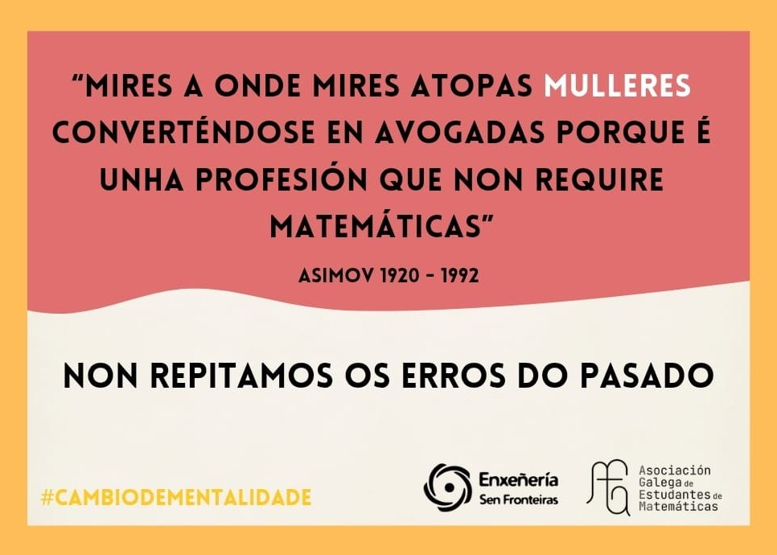

Esta semana, as facultades de toda Galicia comezaron a encherse de tarxetiñas con frases de personaxes históricos. Nós somos os culpables! Colaboramos coa asociación [Enxeñería Sen Fronteiras](https://galicia.isf.es/) na difusión da campaña *"Todo pasa... e todo queda?"*.

## En que consiste a campaña?
Cando pensamos na presencia da muller na ciencia, sempre intentamos atopar esas mulleres que, pese ás dificultades, conseguiron saír adiante e facer grandes contribucións. Procuramos mulleres que quedaron ocultas na historia, por mor da sociedade patriarcal, e mostramos os seus méritos. Esta campaña muda a filosofía: en vez de intentar buscar referentes femininas, queremos atopar a causa de que non as houbese. Así, **mediante frases que dixeron os seus compañeiros homes, entendemos o motivo polo que non conseguisen prosperar**. Vemos que, dende unha posición de alto prestixio, trataban ás mulleres dun xeito insultante, e non as crían capaces de igualar o que eles facían.

Estas frases, que agora nos parecen disparatadas, non se afastan tanto doutras que escoitamos no noso día a día. A diferenza é que estas últimas están adaptadas ao noso tempo, pasando desapercibidas ou considerándose normais, igual que ocorría naquelas épocas. Por iso, dende MaEGA apoiamos un cambio de mentalidade, onde **o respecto e a igualdade, en particular nas matemáticas, son prioritarias**.

Damos as grazas a Enxeñería Sen Fronteiras por deixarnos participar nesta marabillosa iniciativa, na que non só as matemáticas, senón tódalas disciplinas científicas poden fixarse e tomar conciencia.

Se queres facer actividades tan chulas coma esta, non dubides en asociarte a Enxeñería Sen Fronteiras ou a MaEGA e participar nos nosos proxectos!!

## Galería

### A campaña
Deixámosvos aquí tódalas tarxetiñas para que as poidades consultar sempre que queirades.


  
  
  
  
  
  
  
  
  
  
  
  
  
  
  
  


### A difusión
Por último, aquí podedes ver parte da pegada que tivo a campaña nas bibliotecas da USC.



