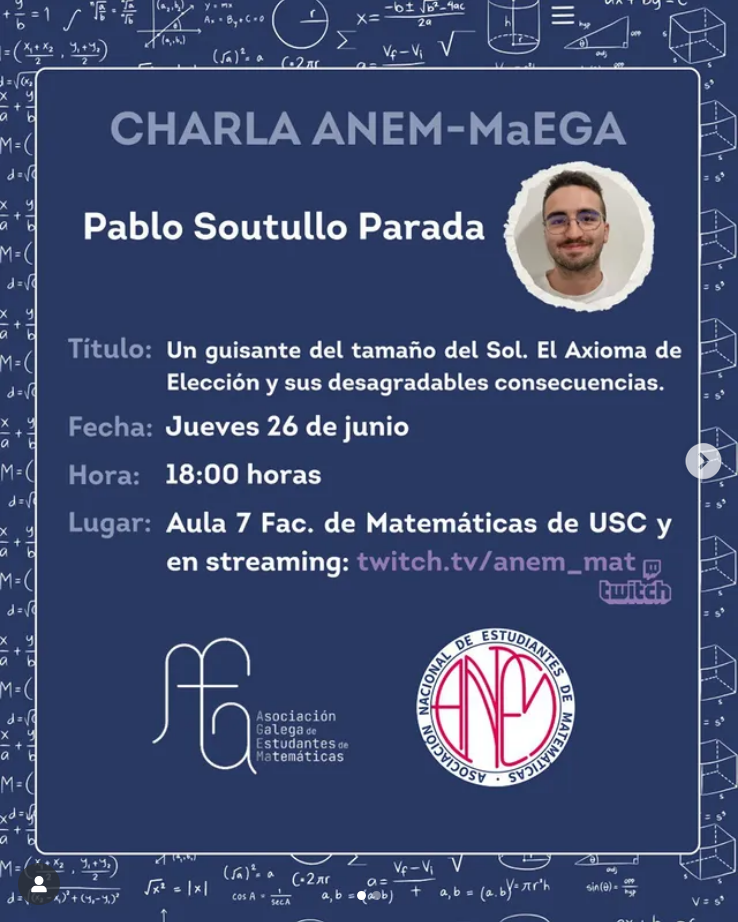

O pasado xoves tivemos o pracer de acoller unha interesante charla impartida por Pablo Soutullo, estudante do Grao en Matemáticas e membro de MaEGA. O evento tivo lugar na Facultade de Matemáticas, en colaboración coa Asociación Nacional de Estudiantes de Matemáticas (ANEM).

<!--  -->



A conferencia puido seguirse tanto de maneira presencial na Facultade como en liña, a través das canles da ANEM, ofrecendo así unha experiencia accesible e interactiva. Os asistentes tiveron ocasión de formular preguntas e manter un coloquio enriquecedor co relator. Pódese ver a charla gravada a través de Twitch:

<!--  -->
<iframe
  src="https://player.twitch.tv/?video=2496496449&parent=localhost"
  height="320"
  width="569"
  autoplay=false
  allowfullscreen>
</iframe>

A intervención xirou arredor do Axioma da Elección e das súas fascinantes implicacións: desde o papel fundamental dos principios axiomáticos na construción das matemáticas ata a historia, necesidade e consecuencias contraintuitivas asociadas a este axioma.

Agardamos seguir organizando máis xornadas matemáticas coma esta e continuar fortalecendo a colaboración coa ANEM nun futuro próximo.

