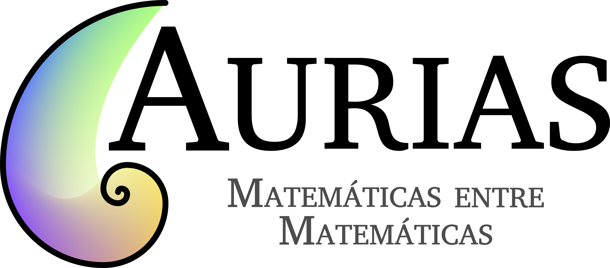

Aurias é un programa de amadriñamento de alumnas do ensino medio (ESO e Bacharelato) por estudantes do grao en Matemáticas (e os dobres graos con Informática e Física).

Este contacto busca potenciar a interese polas matemáticas, tanto por informar sobre a vida universitaria como por promover a participación en actividades de carácter lúdico e na olimpíada matemática.

Ademais, as alumnas poderán contar, se así o desexan cunha preparación básica para enfrontar problemas deste carácter, sempre dende unha visión flexible, divertida e sobre todo, cun contacto achegado.

Todo isto realizarase nunha sesión cada 2 semanas (duración aproximada dunha hora) axendada directamente coas madriñas durante o curso escolar (a excepción de xaneiro e maio, época de exames universitarios).

A maiores, contamos con realizar unha actividade ao cuadrimestre presencial para poder coñecernos en persoa! Se queres incribirte podes facelo a través [deste enlace](https://docs.google.com/forms/d/e/1FAIpQLScOJ_JILc9EY3Qj1GpqrBKo6_lyrdaceS93p0RzgGk0lKLMwA/viewform). Se tes calquera dúbida podes contactarnos a través do correo auriasmat@gmail.com.

