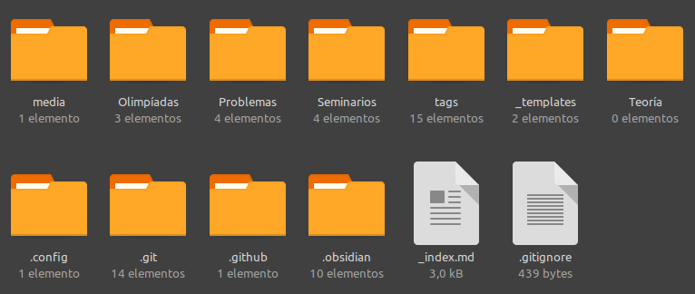

> Este artigo está dirixido a colaboradores e membros de Sementeira con interese en contribuír ao proxecto engadindo materiais á súa [web](https://sementeira.maega.gal/).

A web https://sementeira.maega.gal/ está aloxada no repositorio de Github [GitHub - AntFi03/semweb](https://github.com/AntFi03/semweb). Nel están ademais dos contidos, toda a programación necesaria para facer que a web funcione. Para simplificar este proceso temos o repositorio de Github [GitHub - AntFi03/semweb-obsidian](https://github.com/AntFi03/semweb-obsidian) que está enlazado co anterior (os cambios sincronízanse automaticamente) e só contén o *contido* da web.

Desta forma, a través do software [Obsidian](https://obsidian.md/) que ten soporte de LaTeX (o mellor que coñezo, mellor que Overleaf, TexStudio...) e é un editor de ficheiros `.md` poderedes editar nos vosos equipos directamente o contido da web de xeito autónomo.

Neste documento explico cal é o procedemento paso por paso para instalar nos vosos equipos todo o necesario para poder editar a web e subir os vosos problemas logo de telos empregado nas sesións.

## Titorial para a Instalación do Sistema
Cabe sinalar que o procedemento apenas varía dun sistema operativo a outro, pero por limitacións persoais de tempo e xeneralidade de uso prioricei as indicacións para Windows.

### Windows
#### 1. Crear unha conta de GitHub
O primeiro paso é crear un conta de [GitHub](https://github.com/) (é unha plataforma moi moi coñecida onde a xente sube os seus códigos, e é onde temos funcionando as webs de MaEGA e Sementeira).

#### 2. Solicitar acceso ao repositorio `semweb-obsidian`
Para iso, enviade unha solicitude ao [correo de Sementeira (sementeira.problemas@gmail.com)](mailto:sementeira.problemas@gmail.com) para que vos dé permisos de edición no repositorio [semweb-obsidian](https://github.com/AntFi03/semweb-obsidian). Unha vez que vos engada ao repositorio, teredes que aceptar a invitación mediante un correo que vos chegará ao voso correo electrónico.

#### 3. Instalación de Obsidian
Imos á web de [Obsidian](https://obsidian.md/) e instalamos a versión para o noso sistema.

#### 4. Instalación de Git
Imos á web [Git - Downloads](https://git-scm.com/downloads) e instalamos a versión para o noso sistema.

#### 5. Seleccionade a carpeta local onde aloxar a Web
Obsidian é un editor de texto que traballa sobre os arquivos dun directorio, polo que tendes que elixir unha carpeta do voso ordenador na que vaiades a ter unha copia da web gardada. Vale calquera, mentres teñades espazo dabondo (<1Gb, moi pouco). Se, por exemplo, queredes tela no voso escritorio, non fai falla que creedes unha carpeta expresamente alí, xa o faremos automaticamente nos seguintes pasos, só tendes que decidir a "raíz" onde queirades que estea a web.

#### 6. Clonado do repositorio
Agora tendes que abrir unha consola e clonar o repositorio de GitHub. En cristiano isto vén sendo descargar o contido da web. Para facelo, en windows, debedes de abrir unha terminal con `Win+R` e escribindo `cmd`. Isto abriravos unha terminal. Logo, empregando o comando `cd` navegade ata a carpeta raíz onde queirades que estea a carpeta co contido da web. Unha vez alí executade a seguinte liña de código:
```cmd
git clone https://github.com/AntFi03/semweb-obsidian.git
```
Debedes de indicar o voso usuario de GitHub (usuario, non correo electrónico) e o voso contrasinal. Unha vez feito, debería de ter aparecido na ruta "raíz" unha carpeta chamada `semweb-obsidian` que contén o código do contido da web.

#### 7. Descarga da configuración de Obsidian
Aínda que xa temos o contido, falta a configuración do Obsidian en si (isto non está no repositorio porque idealmente cada quen terá a configuración que máis lle preste). Para axilizar este titorial, descargade do [link](https://drive.google.com/drive/folders/1rcN2MqqJsbccU1N7XUSid5YMB1d3ny1w?usp=sharing) a carpeta `.obsidian` coa configuración do programa. Unha vez descargada, débense colocar dentro da carpeta `semweb-obsidian` que creamos no paso anterior. Debera quedarnos algo do estilo:


#### 8. Abrir a carpeta con Obsidian
Chegados a este punto deixamos atrás as dificultades técnicas do proceso. Abrimos Obsidian. Dependendo de se estamos en castelán ou en inglés pediranos seleccionar unha bóveda ou unha vault (é o nome *fancy* para a "carpeta que contén os ficheiros cos que queres traballar"). No noso caso escollemos a segunda opción "Abrir carpeta como Bóveda/Vault", e escollemos a carpeta `semweb-obsidian`. Unha vez feito iso abrirase Obsidian. Á esquerda estarán as carpetas e ficheiros cos problemas e demais páxinas da web, no medio o editor, e na dereita o panel dos cambios.

#### 9. Manexo de Obsidian
Hai múltiples funcionalidades que tratarei de explicar máis abaixo neste documento. O principal é que temos unha copia local da web, cando abrimos Obsidian, actualízase a nosa carpeta `semweb-obsidian` automaticamente cos cambios que fixera outra xente (isto chámase *pull*, pódese forzar con `Ctrl+Alt+X`). Cando teñamos feitos os nosos cambios temos que subilos, para que non se queden na nosa versión local e pasen ao repositorio, para iso non temos máis que empregar o atallo `Ctrl+Alt+C` (isto chámase *commit & push*). Isto é moi importante, xa que de non facelo, nada do que fagamos repercutirá na web.

Os ficheiros teñen uns metadatos ao inicio. Son autoexplicativos na súa maioría, só sinalar que se creades un documento e non vos dá tempo a acabalo, podedes marcar a opción `draft` para que logo de facer *commit & push* este non se publique na web. Sempre que rematedes de traballar debedes de facer un *commit & push* pensade que pode hacer outra xente traballando no mesmo sen darse conta (o que pode ocasionar conflictos innecesarios).

#### 10. Últimos 2 pasos
Antes de rematar abride a configuración de obsidian (`Ctrl+,`) e seleccionade (abaixo de todo no panel da esquerda) *Git*. Este é o plugin que nos permite sincronizar Obsidian co GitHub. Tendes que buscar a opción de configuración *commit message*, e cambiar o nome de "Usuario" ao voso. Tendes que estar vendo algo como isto:

Isto permíteme a min ver no GitHub quen fai ou deixa de facer os cambios na web máis facilmente.

O ultimísimo paso é máis ben un comentario. Outro dos plugins que empregamos é *Latex Suite*. Este é o que nos brinda o soporte de LaTeX tan fantástico, e é realmente abraiante o ben que funciona. Se o procurades na configuración, podedes ver e editar o ficheiro de *snippets* (atallos) que vos permiten escribir matemáticas máis rápido. De verdade que paga a pena botarlle un ollo. Os esenciais son "ds" para $ $ e "fd" para $$  $$, pero existen moitos outros que na práctica fan case totalmente innecesario volver a empregar a barra invertida "\". 

Con isto queda todo dito. Ante calquera dúbida tendes dúas opcións: romper a cabeza ou preguntarlle a Antón (eu), pasar do tema non é unha opción. Moito ánimo coa informática e espero que desfrutedes o invento!


## Consellos de Uso de Obsidian
### Funcionalidades
#### Trazabilidade dos cambios
Á esquerda de cada liña podedes ver quen foi o último en editar tal línea e a referencia temporal de dita edición.

